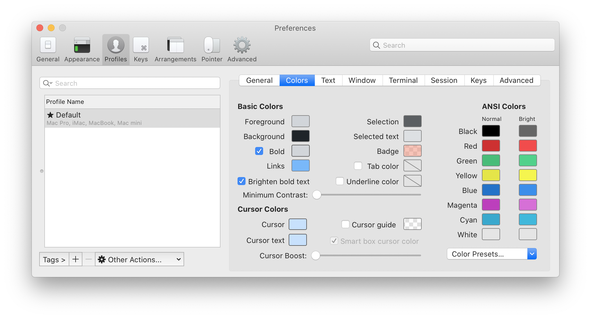

# GitHub Theme Dark for iTerm

[iTerm](https://iterm2.com) theme based on Visual Studio Code [GitHub Theme][vscode-github-theme-marketplace] (Dark)

[![Visual Studio Code - GitHub Theme][vscode-github-theme-image]][vscode-github-theme-marketplace]

Download the [GitHub Theme Dark.itermcolors](https://raw.githubusercontent.com/cdalvaro/github-theme-dark-iterm/master/GitHub%20Theme%20Dark.itermcolors) file and open it. It will be automatically added to your _Color Presets..._ inside _Profiles > Colors_ in iTerm Preferences pane.

You can also download the macOS Terminal app profile: [GitHub Theme Dark.terminal](https://raw.githubusercontent.com/cdalvaro/github-theme-dark-iterm/master/GitHub%20Theme%20Dark.terminal)

[vscode-github-theme-image]: https://user-images.githubusercontent.com/378023/80668639-595e9e00-8add-11ea-8673-4a481cc7e2dd.png
[vscode-github-theme-marketplace]: https://marketplace.visualstudio.com/items?itemName=GitHub.github-vscode-theme
