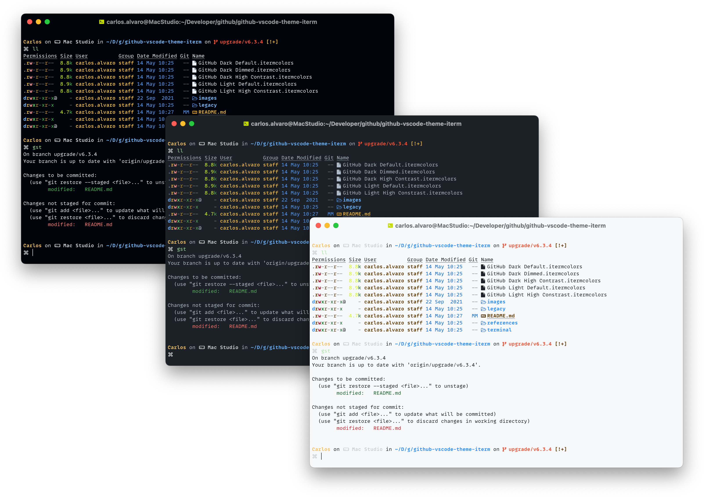

[![GitHub Theme][vscode-github-theme-version]][github-vscode-theme-release]

# GitHub VS Code Theme for iTerm

[GitHub Visual Studio Code Theme][vscode-github-theme-marketplace] for [iTerm](https://iterm2.com) (Dark, Dimmed, Light and High Contrast)

  
  <code>ll</code> is an alias<a href="#f1">1</a> for <a href="https://github.com/ogham/exa"><code>ogham/exa</code></a> cli tool.

Download iTerm profiles and open them.

- [GitHub Dark Default.itermcolors](https://raw.githubusercontent.com/cdalvaro/github-theme-iterm/HEAD/GitHub%20Dark%20Default.itermcolors)
- [GitHub Dark Dimmed.itermcolors](https://raw.githubusercontent.com/cdalvaro/github-theme-iterm/HEAD/GitHub%20Dark%20Dimmed.itermcolors)
- [GitHub Light Default.itermcolors](https://raw.githubusercontent.com/cdalvaro/github-theme-iterm/HEAD/GitHub%20Light%20Default.itermcolors)
- [GitHub Dark High Contrast.itermcolors](https://raw.githubusercontent.com/cdalvaro/github-theme-iterm/HEAD/GitHub%20Dark%20High%20Contrast.itermcolors)

### Classic themes

- [GitHub Dark.itermcolors](https://raw.githubusercontent.com/cdalvaro/github-theme-iterm/HEAD/classic/GitHub%20Dark.itermcolors)
- [GitHub Light.itermcolors](https://raw.githubusercontent.com/cdalvaro/github-theme-iterm/HEAD/classic/GitHub%20Light.itermcolors)

They will be automatically added to your _Color Presets..._ inside _Profiles > Colors_ in iTerm Preferences pane.

## GitHub VSCode Theme for Apple Terminal

You can also download these profiles for Apple Terminal app:

- [GitHub Dark Default.terminal](https://raw.githubusercontent.com/cdalvaro/github-theme-iterm/HEAD/terminal/GitHub%20Dark%20Default.terminal)
- [GitHub Dark Dimmed.terminal](https://raw.githubusercontent.com/cdalvaro/github-theme-iterm/HEAD/terminal/GitHub%20Dark%20Dimmed.terminal)
- [GitHub Light Default.terminal](https://raw.githubusercontent.com/cdalvaro/github-theme-iterm/HEAD/terminal/GitHub%20Light%20Default.terminal)
- [GitHub Dark High Contrast.terminal](https://raw.githubusercontent.com/cdalvaro/github-theme-iterm/HEAD/terminal/GitHub%20Dark%20High%20Contrast.terminal)

### Classic themes

- [GitHub Dark.terminal](https://raw.githubusercontent.com/cdalvaro/github-theme-iterm/HEAD/terminal/classic/GitHub%20Dark.terminal)
- [GitHub Light.terminal](https://raw.githubusercontent.com/cdalvaro/github-theme-iterm/HEAD/terminal/classic/GitHub%20Light.terminal)

[vscode-github-theme-marketplace]: https://marketplace.visualstudio.com/items?itemName=GitHub.github-vscode-theme
[vscode-github-theme-version]: https://img.shields.io/badge/GitHub%20Theme-v5.0.0-007ACC?style=flat-square&logo=visual-studio-code&logoColor=007ACC
[github-vscode-theme-release]: https://github.com/primer/github-vscode-theme/releases/tag/v5.0.0

---

1.  `alias ll='exa --long --header --group --git --modified --color-scale'` [↩️](#a1)

See <a href="https://github.com/cdalvaro/dotfiles/blob/main/.oh-my-zsh/custom/aliases.zsh"><b>cdalvaro/dotfiles</b>/.oh-my-zsh/custom/aliases.zsh</a> for more details.
